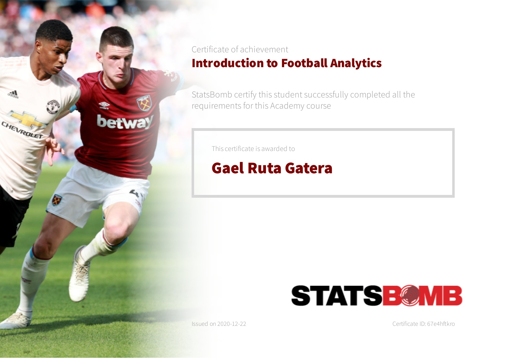

# StatsBombOpenData---ArsenalUndefeated_LSTMNeuralNets
Created a few LSTM sequence to sequence classifiers using StatsBomb Open Data on Arsenal Undefeated Season.
Taking StatsBomb's Introduction to Football Analytics course available at the StatsBomb Academy link: [StatsBomb Academy](https://statsbomb.com/academy/)

Truly enjoyed the course and obtained a certification of completion:

Prompted me to learn a bit more about the company and found the github repository to Data they chose to open source.
Link: [StatsBomb OpenData Github](https://github.com/statsbomb/open-data)

I have been an Arsenal fan for longtime and naturally I chose to find the data that took me back to long lost glory days.
Created an LSTM Binary Sequence to Sequence model prediction that attempts at taking a previous match week results to predict either a win or a draw.

